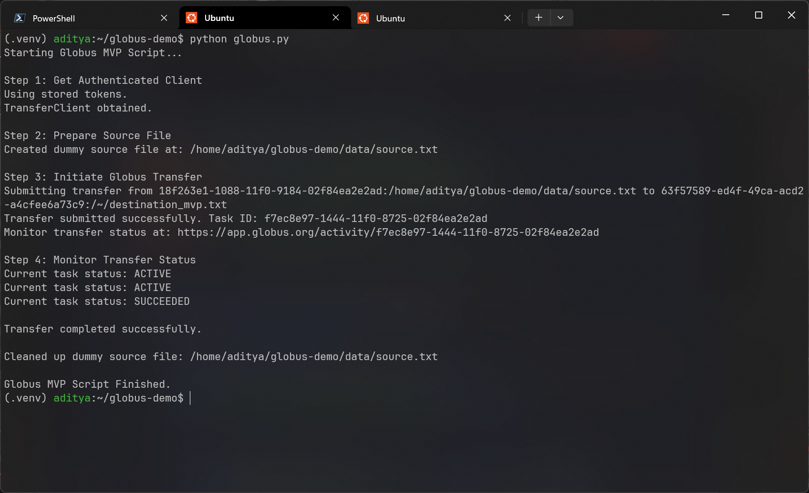

# File Transfer Using Globus SDK
 
This repository contains a simple Python script (`globus.py`) demonstrating a basic file transfer between two Globus endpoints using the Globus SDK.

## The script performs the following steps:

1.  Authenticates the user with Globus using the Native App authentication flow (requires user interaction via browser and code pasting).
2.  Creates a small dummy text file on the local filesystem (source endpoint is Globus Connect Personal running locally).
3.  Initiates a Globus transfer task to move this dummy file from a configured Source Globus Endpoint to a configured Destination Globus Endpoint.
4.  Monitors the transfer task status briefly and prints the final outcome (SUCCEEDED/FAILED).
5.  Cleans up the created dummy source file.

## Terminal output after successful execution

